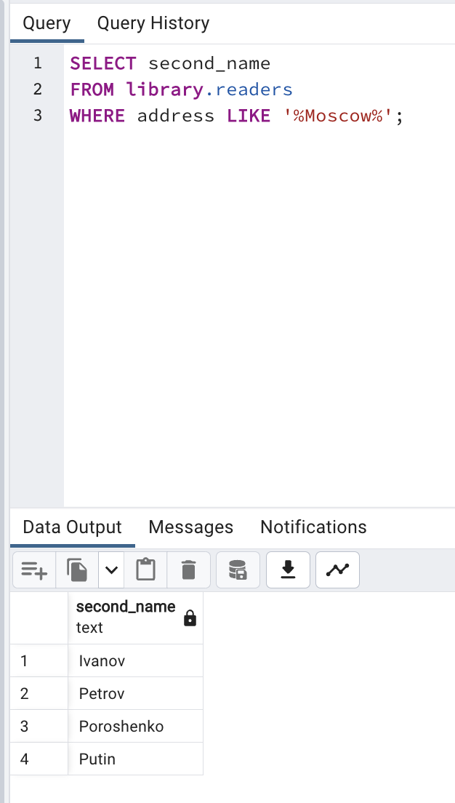
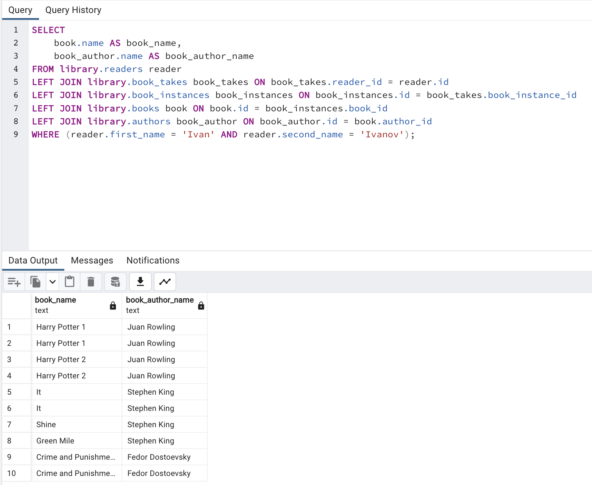
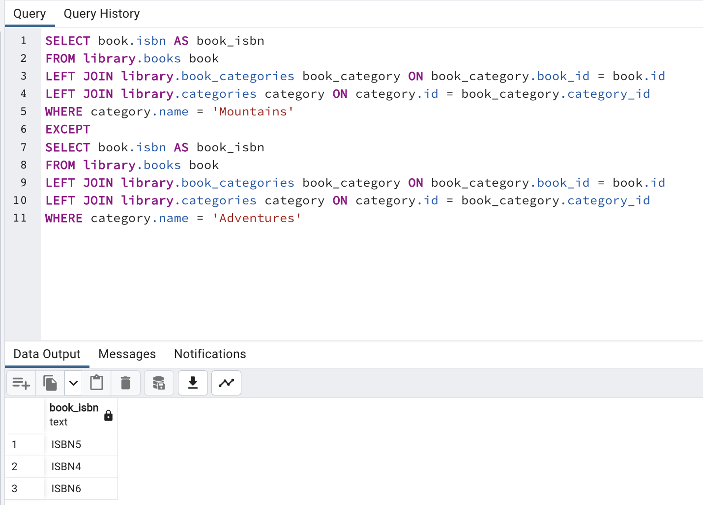
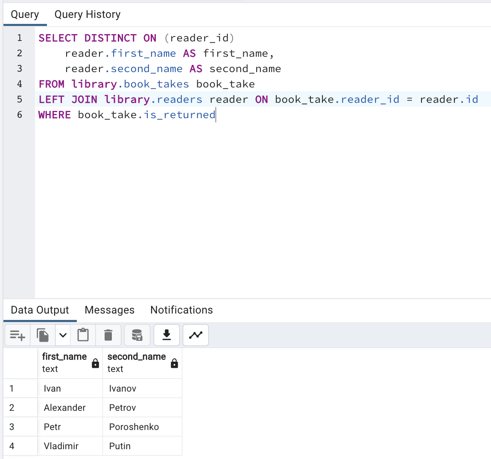
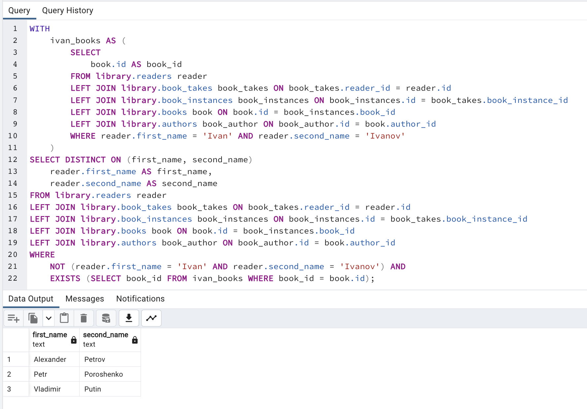

# Task 5

# Library

## а)
```sql
-- а) Какие фамилии читателей в Москве?
SELECT second_name 
FROM library.readers 
WHERE address LIKE '%Moscow%';
```



## б)
```sql
-- б) Какие книги (author, title) брал Иван Иванов? 
SELECT 
    book.name AS book_name,  
    book_author.name AS book_author_name
FROM library.readers reader
LEFT JOIN library.book_takes book_takes ON book_takes.reader_id = reader.id 
LEFT JOIN library.book_instances book_instances ON book_instances.id = book_takes.book_instance_id  
LEFT JOIN library.books book ON book.id = book_instances.book_id  
LEFT JOIN library.authors book_author ON book_author.id = book.author_id 
WHERE reader.first_name = 'Ivan' AND reader.second_name = 'Ivanov';
```



## в)
```sql
-- в) Какие книги (ISBN) из категории "Горы" не относятся к категории "Путешествия"? Подкатегории не обязательно принимать во внимание!
SELECT book.isbn AS book_isbn
FROM library.books book 
LEFT JOIN library.book_categories book_category ON book_category.book_id = book.id  
LEFT JOIN library.categories category ON category.id = book_category.category_id
WHERE category.name = 'Mountains'
EXCEPT
SELECT book.isbn AS book_isbn
FROM library.books book 
LEFT JOIN library.book_categories book_category ON book_category.book_id = book.id  
LEFT JOIN library.categories category ON category.id = book_category.category_id
WHERE category.name = 'Adventures';
```



## г)
```sql
-- г) Какие читатели (LastName, FirstName) вернули копию книги? 
SELECT DISTINCT ON (reader_id)
    reader.first_name AS first_name,
    reader.second_name AS second_name
FROM library.book_takes book_take
WHERE book_take.is_returned
LEFT JOIN library.readers reader ON book_take.reader_id = reader.id
```



## д)
```sql
-- д) Какие читатели (LastName, FirstName) брали хотя бы одну книгу (не копию), которую брал также Иван Иванов 
-- (не включайте Ивана Иванова в результат)?
WITH
    ivan_books AS (
        SELECT 
            book.id AS book_id
        FROM library.readers reader
        LEFT JOIN library.book_takes book_takes ON book_takes.reader_id = reader.id 
        LEFT JOIN library.book_instances book_instances ON book_instances.id = book_takes.book_instance_id  
        LEFT JOIN library.books book ON book.id = book_instances.book_id  
        LEFT JOIN library.authors book_author ON book_author.id = book.author_id 
        WHERE reader.first_name = 'Ivan' AND reader.second_name = 'Ivanov'
    )
SELECT DISTINCT ON (first_name, second_name)
    reader.first_name AS first_name,
    reader.second_name AS second_name
FROM library.readers reader
LEFT JOIN library.book_takes book_takes ON book_takes.reader_id = reader.id 
LEFT JOIN library.book_instances book_instances ON book_instances.id = book_takes.book_instance_id  
LEFT JOIN library.books book ON book.id = book_instances.book_id  
LEFT JOIN library.authors book_author ON book_author.id = book.author_id 
WHERE 
    NOT (reader.first_name = 'Ivan' AND reader.second_name = 'Ivanov') AND
    EXISTS (SELECT book_id FROM ivan_books WHERE book_id = book.id);
```



# Railway

У меня изначально схема отличалась от той, которая нужна. Так что запросы без уверенности, что они работают.


## а)
```sql
-- а) Найдите все прямые рейсы из Москвы в Тверь.
SELECT 
    train.train_number AS train_number,
    train.start_station_name AS start_station_name,
    train.end_station_name AS end_station_name,
    train.depature AS depature,
    train.arrival AS arrival
FROM railway.connections connection
LEFT JOIN railway.trains train ON train.train_number = connection.train_number
LEFT JOIN railway.stations from_station ON from_station.name = connection.from_station
LEFT JOIN railway.stations to_station ON to_station.name = connection.to_station
LEFT JOIN railway.cities from_city ON from_city.name = from_station.city_name
LEFT JOIN railway.cities to_city ON to_city.name = to_city.city_name
WHERE from_city.name = 'Moscow' AND to_city.name = 'Tver';
```

## б)

Не сделал пока